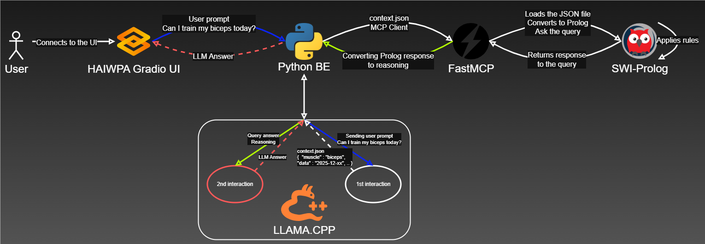
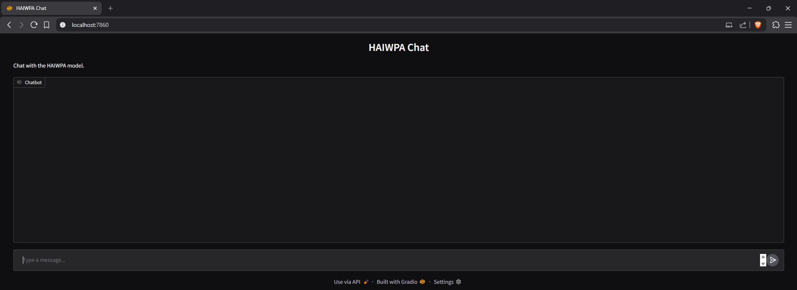

# HAIWPA
Hybrid AI Workout Planning Assistant is developped in the [Informatique et systèmes de communication](https://isc.hevs.ch/learn) Bachelor's degree program for the semester project.

## Overview
This project aims to develop a smart workout planning assistant that understands natural language requests from users and verifies whether a training session is appropriate based on physiological and logical constraints.

The core objective is to demonstrate a hybrid AI approach that combines symbolic reasoning (constraint logic programming) with generative models. By ensuring that **logical decisions computed by Prolog always take priority over generative output**, the system minimizes hallucinations commonly seen with standalone LLM usage. The LLM must not introduce unsupported conclusions or overlook constraint violations detected by symbolic reasoning.

## Table of contents
- [Overview](#overview)
- [Architecture](#architecture)
- [Requirements](#requirements)
- [How to use | User guide](#how-to-use--user-guide)
- [Examples](#examples)
- [Developer guide](#developer-guide)
    - [Code structure](#code-structure)
    - [config.py](#configpy)
    - [haiwpa_backend.py](#haiwpa_backendpy)
    - [haiwpa_chat.py](#haiwpa_chatpy)
    - [haiwpa_mcp.py](#haiwpa_mcppy)
    - [haiwpa_workout.py](#haiwpa_workoutpy)
    - [workout_rules.pl](#workout_rulespl)
    - [Unit tests](#unit-tests)
- [Future upgrades](#future-upgrades)
- [Conclusion](#conclusion)
- [Acknowledgements](#acknowledgements)
- [Sources](#sources)

## Architecture
The architecture of this project is composed with :

- **Gradio web interface** provides a chat-based user interface using the ChatInterface model. It enables interaction with natural language.
- **Python backend** is the central orchestration layer connecting all components. It handles the interaction flow between the Gradio interface, the LLM, and the MCP server. The main components are saving the LLM extracted information to the `context.json` file, interacting as an MCP client with the MCP server, as well as waiting for the Prolog answer to resend it to the LLM.
- **Llama.cpp** is the local LLM used to answer user queries with two different scenarios:
    * **Extracting workout information** in a JSON format.
    * **Answering** the user based on the Prolog reasoning.
- **FastMCP server** is used to transform information from the `context.json` file to Prolog queries as well as to send them to SWI-Prolog.
- **SWI-Prolog** is the Symbolic AI part in this project, which is meant to accept or refuse a workout based on the workout history and the future workouts of the user. To do this, simple predicates were created to answer the FastMCP queries.



## Requirements
- [Llama.cpp](https://github.com/ggml-org/llama.cpp)
- [SWI-Prolog](https://www.swi-prolog.org/)
- [Python](https://www.python.org/)
- [uv](https://docs.astral.sh/uv/)
- [.gguf](https://huggingface.co/docs/hub/en/gguf) model

> Be sure, that `uv` is installed and added to the environment PATH.

> Llama.cpp contains multiple version to install, depending on the computer hardware, be sure to install the appropriate one (GPU or CPU).

> The LLM model used for this project is [`Llama-3.2-3B-Instruct-GGUF`](https://huggingface.co/bartowski/Llama-3.2-3B-Instruct-GGUF), downloaded from [HuggingFace](https://huggingface.co/).

## How to use | User guide
1. Clone the repository.
``` bash
git clone https://github.com/HEI-courses/303.1_2025_LLM_MCP_Prolog_integration
```

2. Go to the `303.1_2025_LLM_MCP_Prolog_integration` folder.
```bash
cd 303.1_2025_LLM_MCP_Prolog_integration
```

3. Synchronize the virtual environment.
```bash
uv sync
```

4. Launch the Llama.cpp server in a terminal.

```bash
llama-server -m model.gguf --host 0.0.0.0 --port 8081
```
    
> ⚠️ **Note:** Please make sure that the port used in this command is the same as in `LLM_SERVER_1_URL` that can be found in `config.py`, if not, update it accordingly (e.g., `http://localhost:YOUR_PORT`)

5. Launch the FastMCP server.
```bash
uv run fastmcp run haiwpa_mcp.py --transport http --port 9000
```

6. Launch the HAIWPA Chatbot.
```bash
uv run haiwpa_chat.py
```

7. Access the Chatbot threw a web browser with [`http://localhost:7860/`](http://localhost:7860/) address.



## Examples
Here are some examples of the HAIWPA application.

[videos/compressed_example_no_fitness_with_history.mp4](videos/compressed_example_no_fitness_with_history.mp4)

[videos/compressed_injured_trained_together_muscle.mp4](videos/compressed_injured_trained_together_muscle.mp4)

[videos/compressed_insufficent_rest_same_muscle.mp4](videos/compressed_insufficent_rest_same_muscle.mp4)

[videos/compressed_trained_together_muscles_approved.mp4](videos/compressed_trained_together_muscles_approved.mp4)

## Developer guide
This section is for developers that would be interested to update or modify the actual project.

**Steps :**

1. Fork the repository.
2. Pass the tests from [Unit tests](#unit-tests)
3. Make a pull request.

### Code structure
Here is a short description for each folder/file that can be found after the repository clone.
```bash
├── data/                           # Folder containing workout history
├──────── context.json
├── images/                         # Folder containing images for the README.md
├── test_data/                      # Folder containg JSON data for validation
├──────────── approved_workout.json
├──────── injury_present.json
├──────── insufficient_rest.json
├──────── trained_together_injury.json
├── tests/                          # Folder containg unit and system tests
├──────── test_backend_mcp.py
├──────── test_mcp_helpers.py
├──────── test_mcp_integration.py
├──────── test_prolog_rules.py
├──────── test_workout_extraction.py
├── videos/                         # Example videos of the application
├── config.py                       # Constants file
├── haiwpa_backend.py               # Backend module
├── haiwpa_chat.py                  # Gradio web interface module
├── haiwpa_mcp.py                   # MCP Server used to interact with SWI-Prolog
├── haiwpa_workout.py               # Workout extraction to `context.json` file
├── pyproject.toml                  # Project configuration file
├── README.md                       # Project overview, user guide, developer guide, etc.
└── workout_rules.pl                # SWI-Prolog predicates
```

### config.py
This file contains constants used along all modules.

```python
LLM_SERVER_1_URL = "http://localhost:8081"
MCP_SERVER_URL = "http://localhost:9000"
GRADIO_SERVER_URL = "127.0.0.1"
...
FITNESS_KEYWORDS = "biceps, triceps, ..."
LLM_CONTEXT_FOR_ANSWER =  "WORKOUT VALIDATION :\n" + ...
```

### haiwpa_backend.py
This module is the central orchestration layer that connects Gradio, the LLM, and the MCP server. It handles message processing, fitness extraction, and validation context building.

It uses the `openai` library to interact with the Llama.cpp server, the `instructor` library for structured JSON extraction, and the `fastmcp` library for MCP client calls.

The `HAIWPABackend` class initializes three clients :
```python
class HAIWPABackend:
    def __init__(self):
        # OpenAI client for chat completions
        self.client = OpenAI(
            base_url=f"{config.LLM_SERVER_1_URL}/v1", api_key=config.API_KEY
        )

        # Instructor client for structured JSON extraction
        self.instructor_client = instructor.from_openai(
            OpenAI(base_url=f"{config.LLM_SERVER_1_URL}/v1", api_key=config.API_KEY),
            mode=instructor.Mode.JSON,
        )

        # MCP client for Prolog validation
        self.mcp_client = Client(f"{config.MCP_SERVER_URL}/mcp")
        ...
```

These clients connect to different services running on separate ports.

The `chat()` method sends a messages array to the LLM and returns the response :
```python
def chat(self, messages):
    try:
        response = self.client.chat.completions.create(
            model=self.model_name,
            messages=messages,
            temperature=self.temperature,
            max_tokens=self.max_tokens,
        )
        return response.choices[0].message.content
    except Exception as e:
        return f"Error: {str(e)}"
```

The `is_fitness_related()` function checks if the user message contains any fitness keyword from `config.FITNESS_KEYWORDS`. This list can be updated if needed. 

This determines whether to trigger the extraction process :
```python
def is_fitness_related(self, message: str) -> bool:
    fitness_keywords = config.FITNESS_KEYWORDS
    message_lower = message.lower()
    return any(keyword in message_lower for keyword in fitness_keywords)
```
The `extract_fitness_info()` method uses the Instructor client to extract structured data from natural language.

It tries with a maximum number of three retries.

The temperature for this prompt is lower $(0.3)$, because we want less randomness in the answer compared to the normal LLM conversation as it was in `init()` method.

It returns a list of `FitnessExtract` sessions or `None` on failure :
```python
def extract_fitness_info(self, user_input):
    try:
        response = self.instructor_client.chat.completions.create(
            model=self.model_name,
            messages=[
                {
                    "role": "user",
                    "content": f"Extract fitness information from the following input:\n{user_input} using a JSON format",
                }
            ],
            response_model=MultipleFitnessExtract,
            temperature=config.TEMPERATURE_2,
            max_retries=3,
        )
        if response and hasattr(response, "sessions"):
            return response.sessions
        return None
    except Exception as e:
        ...
```

The `gradio_to_messages()` method converts Gradio's message format to OpenAI API format.

Gradio uses `{role, content: [{type, text}]}` while OpenAI expects `{role, content: str}` :
```python
def gradio_to_messages(self, message):
    role = message.get("role")
    content = message.get("content")

    # Content is already a string (OpenAI API format)
    if isinstance(content, str):
        return {"role": role, "content": content}

    # Content is a list (Gradio format)
    if isinstance(content, list):
        if len(content) > 0 and isinstance(content[0], dict):
            text = content[0].get("text", "")
            return {"role": role, "content": text}

    return None
```
The use of this method ensures that the communication is correct between Gradio web interface and the Llama.cpp LLM. At the beginning of the project, we decided with the professor, that we will focus only on string type of messages without images, etc.

Then, `convert_validation_to_message()` method transforms MCP validation results into a system prompt for the LLM.

It includes the Prolog validation status, reason, and instructions on how the LLM should respond :
```python
def convert_validation_to_message(self, validation_results: str):
    res = config.LLM_CONTEXT_FOR_ANSWER

    if not validation_results:
        return None

    for r in validation_results:
        muscle = r.get("muscle")
        ...
        max_rest_days = r.get("max_rest_days")

        if approved:
            res += f"- {muscle} on {date} : prolog_validation=True - prolog_reason={reason}\n"
        else:
            res += f"- {muscle} on {date}: prolog_validation=False - prolog_reason={reason}\n"
            res += f"Use this max rest days value : {max_rest_days} which is in days for the recent workout history. \n"

    return res
```

This method will be used with `validate_workout_mcp()` function in the main orchestration function which is `chat_with_history()`.

The `validate_workout_mcp()` is an async function that calls the MCP server's `validate_all_planned_workouts` tool and returns the parsed JSON results :
```python
async def validate_workout_mcp(self, file_path: str = config.CONTEXT_FILE):
    try:
        async with self.mcp_client:
            result = await self.mcp_client.call_tool(
                "validate_all_planned_workouts"
            )

            if result and result.content:
                return json.loads(result.content[0].text)

            return result
    except Exception as e:
        return None
```

Finally, we have `chat_with_history()` which is the main orchestration function that handles the complete workflow :

Check if fitness-related → extract data → save to JSON → validate via Prolog through MCP → build context → send to LLM :
```python
async def chat_with_history(self, current_message, history):
    validation_context = ""

    # Only process fitness-related messages
    if self.is_fitness_related(current_message):
        ...
        fitness_sessions = self.extract_fitness_info(current_message)
        if fitness_sessions:
            for session in fitness_sessions:
                # extracting and saving to a .json file
            
            # Validate via MCP/Prolog
            validation_results = await self.validate_workout_mcp()
            if validation_results:
                validation_context = self.convert_validation_to_message(validation_results)

    # Convert Gradio history to OpenAI format
    messages = []
    if history:
        for msg in history:
            converted_message = self.gradio_to_messages(msg)
            if converted_message:
                messages.append(converted_message)

    # Add validation context as system message/prompt
    if validation_context:
        messages.append({"role": "system", "content": validation_context})

    # Add current user message and send to LLM
    messages.append({"role": "user", "content": current_message})
    return self.chat(messages)
```
All these methods enable the user to interact with Llama.cpp through the Gradio web interface. Fitness-related messages trigger the full validation pipeline (workout extraction, MCP, Prolog reasoning), while all messages use conversation history to maintain context.

### haiwpa_chat.py
This module uses the `gradio` library, the `HAIWPABackend` class from `haiwpa_backend.py`, and the `config` module.

It provides the Gradio ChatInterface for user interaction with the local LLM. The `chat_function()` function handles the communication between the user and the backend.

This function takes the user input (a prompt written in natural language) and the conversation history (empty at the beginning) as parameters.

```python
# Main function which is used to answer user prompts with message history
async def chat_function(user_input, history):
    return await backend.chat_with_history(user_input, history)
```

The function that makes the interaction between the Gradio Interface and the backend is found in `create_interface()`.

```python
def create_interface():
    demo = gr.ChatInterface(
        fn=chat_function, title="HAIWPA Chat", description="Chat with the HAIWPA model."
    )
    return demo
```

### haiwpa_workout.py
This module uses Pydantic's `BaseModel` and `Field` as main components to extract information from the user's natural language prompt.

When the system detects a fitness-related message (via the backend's `is_fitness_related()` function), it calls the Llama.cpp server to extract the following fields :

```python
# Class to extract fitness exercises, duration limits, recent training history, injuries from user input
muscle: str = Field(description="...")
exercises: str = Field(description="...")
duration: float = Field(description="...", default=0.0)
date: str = Field(description="...", default={today_date()})
injuries: str = Field(description="...", default="")
entry_type: str = Field(description="...")
```

The most important part in this file is the description of each field. Since the LLM is a statistical system that predicts output based on input context, the goal is to extract information from the prompt without hallucination. To achieve this, we need to ensure that the LLM understands correctly what has to be done and how it should be formatted.

The muscle, exercises, injuries as well as the duration are normally easy to extract, because it is straightforward, we do not need to manipulate them.

However, the **date** field is more vulnerable to errors. By default, the LLM does not know what "today", "yesterday", or "in some days" means. This information must be provided explicitly. For this project, the `today_date()` function was created to inject the current date when the user sends the prompt.

This function returns a date in the US format like `2025-12-16`.
```python
def today_date() -> str:
    return datetime.datetime.now().strftime("%Y-%m-%d")
```

The next description that is as important as the date is the **entry_type**. It defines whether the user is talking about a past workout or a future one. This distinction is crucial for the MCP server to determine which muscle groups require Prolog validation.

Once, the extraction done, the next is to save it for future uses like the MCP conversion to Prolog. It could be done without saving into the JSON file, but it helps with debug.

Here is an example of correctly extracted content that is saved in the `context.json` :
```json
[
    {
        "timestamp": "2025-12-16T09:37:16.861858",
        "user_input": "Hello, I worked biceps curls for 10 minutes today. I want to know if I can work my triceps today?",
        "muscle": "biceps",
        "exercises": "biceps curls",
        "duration": 10.0,
        "date": "2025-12-16",
        "injuries": "",
        "entry_type": "completed"
    },
    {
        "timestamp": "2025-12-16T09:37:16.861858",
        "user_input": "Hello, I worked biceps curls for 10 minutes today. I want to know if I can work my triceps today?",
        "muscle": "triceps",
        "exercises": "",
        "duration": 0.0,
        "date": "2025-12-16",
        "injuries": "",
        "entry_type": "planned"
    },
  ...
]
```

### haiwpa_mcp.py
This module contains the FastMCP server, the JSON input reading, and serves as a bridge between the backend and SWI-Prolog.

It uses the `fastmcp` library to create the FastMCP server and the `pyswip` library to interact with SWI-Prolog.

At the beginning, a check is performed to ensure that Prolog rules are accessible by using the `connection_test` query.

```python
# Load Prolog knowledge base
prolog.consult("workout_rules.pl")

# Unit test to check if the connexion with Prolog worked
list(prolog.query("connection_test."))
```

If we do not see :
```bash
Workout rules module loaded successfully.
```

Then the connection failed and we will not be able to interact with SWI-Prolog.

Once the connection is established, the next step is cleaning the SWI-Prolog knowledge base and initializing it with workout history. The `load_json_workout_context()` function handles this.

It requires the JSON file path found in the config file as `config.CONTEXT_FILE`.
```python
# Load JSON workout context from file and assert into Prolog knowledge base
def load_json_workout_context(file_path=config.CONTEXT_FILE):
    ...
    # Clearing previous data in SWI-Prolog
    list(prolog.query("retractall(workout_history(_, _, _, _))."))
    list(prolog.query("retractall(injury(_, _))."))

    planned_workout = []

    # Load JSON data
    with open(file_path, "r") as f:
        data = json.load(f)

    # JSON data parsing
    for entry in data:
        ...
        entry_type = entry["entry_type"]
        ...
        if entry_type == "completed":
        elif entry_type == "planned":

    return planned_workout
```

From there, the workout history is sent to Prolog. The next step is to validate a muscle based on its name and the date the user wants to train it. The `validate_single_workout()` function handles this.

```python
# Validate if a workout for a specific muscle group is allowed on a given date (yes/no).
# It returns {"approved": bool, "reason": str}
def validate_single_workout(muscle: str, date: str):
    ...

    query = f"can_workout(...)."
    results = list(prolog.query(query))

    if results:
        reason = results[0]["Reason"]

        if reason == "workout_allowed":
        elif reason == "injury_present":
        elif reason == "trained_together_injured":
        elif reason == "insufficient_rest":
        ...

    return ...
```

At this point, the MCP server has the answer from Prolog reasoning and needs to send it to the backend. Before doing so, the **Reason** must be reformatted into a natural language explanation instead of raw Prolog predicate results. This provides more context for the LLM rather than just keywords.

The last part of this module is the `validate_all_planned_workouts()` function, which validates all planned muscle workouts instead of just one. This is the main MCP function and requires the `@mcp.tool()` decorator so that an MCP client can call it.

```python
# MCP Tool to validate all planned workouts from the JSON context file
# It returns a list of validation results for each planned workout
@mcp.tool()
def validate_all_planned_workouts():
    planned_workouts = load_json_workout_context()
    results = []
    max_rest_days = 0

    if not planned_workouts:
        return results

    # Getting the max rest from Prolog
    max_rest_days_query = list(prolog.query("suggested_rest_days(MaxRestDays)."))
    max_rest_days = max_rest_days_query[0]["MaxRestDays"]
    ...

    for workout in planned_workouts:
        validation = validate_single_workout(workout["muscle"], workout["date"])
        results.append(
            ...
        )

    return results
```

Prolog works with UNIX timestamps, but dates in `context.json` are saved in ISO format. The `convert_date_to_timestamp()` function ensures correct conversion before sending data to Prolog. It also handles EU format dates (DD.MM.YYYY) by converting them to ISO format first.

```python
# Used to convert a US date to UNIX timestamp
def convert_date_to_timestamp(date_str: str):
    # if date_str looks like "DD.MM.YYYY", convert it to the format "YYYY-MM-DD"
    if "." in date_str:
        day, month, year = date_str.split(".")
        date_str = f"{year}-{month}-{day}"
    dt = datetime.strptime(date_str, "%Y-%m-%d")
    return int(dt.timestamp())  # Convert to UNIX timestamp
```

There are also two helper functions:
- `suggest_workout()` - Sends a query to Prolog that returns a list of suggested alternatives for a muscle group that cannot be trained (due to injury or insufficient rest).
- `format_suggested_workout()` - Formats the list of alternatives into a comma-separated string.

### workout_rules.pl
This file contains the SWI-Prolog knowledge base with workout validation rules, muscle data, and constraint logic. This is the symbolic AI component that returns decisions with the reasoning.

It uses SWI-Prolog predicates like `findall/3` to collect results into lists and `max_list/2` to find maximum values.

It starts with facts that define exercises, muscle groups, required rest day(s), injury recovery per muscle group as well as relations between muscle groups that could be trained together.
```prolog
% Exercises mapped to muscle groups
exercise('bench press', chest).
exercise('curls', biceps).
...

% Valid muscle groups
muscle_group(chest).
muscle_group(biceps).
...

% Rest days required per muscle (1-2 days)
rest_day_required(biceps, 1).
rest_day_required(chest, 2).
...

% Injury recovery time per muscle (14-28 days)
injury_recovery_days(biceps, 14).
injury_recovery_days(chest, 28).
...

% Synergistic muscles (often trained together)
trained_together(chest, triceps).
trained_together(back, biceps).
...
```

Then, we have dynamic facts that are asserted at runtime from the JSON context file via the MCP server :
```prolog
:- dynamic workout_history/4.  % workout_history(Date, Muscle, Exercise, Duration)
:- dynamic injury/2.           % injury(Date, Muscle)
```

To check if the user has a correct rest time, there is the `days_between()` predicate that receives two UNIX timestamps and as output has the number of `Days`.
```prolog
days_between(Date1, Date2, Days):-
    Days is round((Date2 - Date1) / (24 * 60 * 60)).
```

These predicates check specific conditions for workout validation :

- `recently_trained/2` - Returns true if a muscle was trained within its required rest period :
```prolog
recently_trained(Muscle, Date):-
    workout_history(WorkoutDate, Muscle, _, _),
    days_between(WorkoutDate, Date, Days),
    rest_day_required(Muscle, RequiredRestDays),
    Days < RequiredRestDays.
```
- `has_injury/2` - Returns true if a muscle has an active injury (within recovery period) :
```prolog
has_injury(Muscle, CurrentDate):-
    injury(InjuryDate, Muscle),
    injury_recovery_days(Muscle, RecoveryDays),
    days_between(InjuryDate, CurrentDate, DaysSinceInjury),
    DaysSinceInjury < RecoveryDays.
```
- `trained_together_has_injury/3` - Returns true if a synergistic muscle is injured, and identifies which one :
```prolog
trained_together_has_injury(Muscle, CurrentDate, InjuredMuscle):-
    (trained_together(Muscle, InjuredMuscle); trained_together(InjuredMuscle, Muscle)),
    has_injury(InjuredMuscle, CurrentDate).
```

The main validation rule is `can_workout/3`. It checks conditions in priority order and returns a reason :
```prolog
% 1. Check if injured
can_workout(Muscle, Date, 'injury_present'):-
    has_injury(Muscle, Date).

% 2. Check if a muscle trained together with the target muscle is injured
% the ! to stop backtracking after the first try
can_workout(Muscle, Date, 'trained_together_injured'):-
    trained_together_has_injury(Muscle, Date, _), !.

% 3. Check if recently trained
can_workout(Muscle, Date, 'insufficient_rest'):-
    recently_trained(Muscle, Date).

% 4. Returning true if both checks are passed
% \+ for negation
can_workout(Muscle, Date, 'workout_allowed'):-
    \+ has_injury(Muscle, Date),
    \+ trained_together_has_injury(Muscle, Date, _),
    \+ recently_trained(Muscle, Date).
```

The `!` (cut) operator stops backtracking after finding a match, ensuring only one reason is returned. The `\+` operator is negation (returns true if the predicate fails).

When a workout is not allowed, these predicates suggest safe alternatives :

- `alternative_muscle/2` - Finds muscles that are not synergistically related to the target :
```prolog
alternative_muscle(Muscle, AlternativeMuscle):-
    muscle_group(AlternativeMuscle),
    AlternativeMuscle \= Muscle,
    \+ trained_together(Muscle, AlternativeMuscle).
```

- `suggest_alternative/3` - Suggests muscles that can be safely trained instead :
```prolog
% If can_workout is not allowed, then it proposes other muscle groups
% once because if all are true, it was suggesting muscles for each validation.
suggest_alternative(Muscle, Date, AlternativeMuscle):-
    once((has_injury(Muscle, Date); trained_together_has_injury(Muscle, Date, _); recently_trained(Muscle, Date))),
    alternative_muscle(Muscle, AlternativeMuscle),
    can_workout(AlternativeMuscle, Date, 'workout_allowed').
```

The `once/1` predicate ensures the condition check runs only once, avoiding duplicate suggestions.

Finally, `suggested_rest_days/1` returns the maximum rest days from the current workout history. It uses `findall/3` to collect all rest requirements and `max_list/2` to find the maximum :
```prolog
suggested_rest_days(MaxRestDays):-
    max_day_required(MaxRestDays).

max_day_required(MaxRestDays):-
    workout_rest_days(RestDays),
    max_list(RestDays, MaxRestDays).

workout_rest_days(RestDays):-
    findall(RestDay, (workout_history(_, Muscle, _, _), rest_day_required(Muscle, RestDay)), RestDays).
```

### Unit tests
Unit tests are there to check if all blocks of the pipeline works as expected.

It is good to launch the unit tests before the launching the actual project, but as well if a developer want to test their modified function, update, etc. 

> **Note :** This tests were generated by Claude AI based on the repository code.

1. **Workout extraction**
    ```bash
    uv run pytest tests/test_workout_extraction.py -v
    ```

    What is tested :
    - `today_date()`                    : Format validation, datetime matching
    - `FitnessExtract`                  : Model creation, JSON serialization, `save_to_json()`
    - `MultipleFitnessExtract`          : Multiple sessions, empty lists

2. **Prolog rules**
    ```bash
    uv run pytest tests/test_prolog_rules.py -v
    ```

    What is tested :
    - `connection_test/0`               : Prolog connection
    - `muscle_group/1`                  : Valid/Invalid muscle groups
    - `rest_day_requried/2`             : 1/2 day(s) rest requirements
    - `injury_recovery_days/2`          : 14/21/28 days recovery periods
    - `trained_together/2`              : Synergistic muscle relationships
    - `exercise/2`                      : Exercise to muscle mapping
    - `can_workout/3`                   : Testing all 4 validation cases
    - `suggest_alternative/3`           : Alternative muscles suggestions
    - `has_injury/2`                    : Injury detection with dates
    - `sufficient_rest/3`               : Rest period validation
    - `days_between/3`                  : Date arithmetic

3. **MCP helpers**
    ```bash
    uv run pytest tests/test_mcp_helpers.py -v
    ```

    What is tested :
    - `convert_date_to_timestamp()`     : ISO and European date formats
    - `format_suggested_workout()`      : String formatting, edge cases
    - `validate_single_workout()`       : Return structure, invalid muscles

    > For the test 4 and 5, you will need to start the MCP server as it shown in the [How to use | User guide](#how-to-use--user-guide) section.
    ```bash
    uv run fastmcp run haiwpa_mcp.py --transport http --port 9000
    ```

4. **MCP server**
    ```bash
    uv run pytest tests/test_mcp_integration.py -v
    ```

    What is tested :
    - `MCP Connection`                  : Server reachability, tool availability

5. **Backend <-> MCP**
    ```bash
    uv run pytest tests/test_backend_mcp.py -v
    ```

    What is tested :
    - `is_fitness_related()`            : Keyword detection
    - `gradio_to_messages()`            : Format conversion
    - `convert_validation_to_message()` : MCP call structure


## Future upgrades
For future upgrades, I would like to implement the following improvements :
- More realistic Prolog rules, enabling better reasoning based on real-world information rather than synthetic data.
- Additional MCP tools for interacting with the SWI-Prolog knowledge base, such as simple queries to retrieve all exercises targeting a specific muscle group (e.g., biceps), the minimum required rest days, and similar information.
- An improved mechanism for saving context.json and updating workout statuses from "planned" to "completed" automatically after a certain time. Currently, the file must be cleared for the system to function properly, as it stores all fitness-related information extracted from user prompts that could be falsified.
- A more robust method for extracting dates and times from user prompts. At present, when a user provides a date, the time is ignored. This can lead to inconsistencies, for example when a workout completed at 23:59 is considered valid again at midnight, since only the day (ISO format) is being checked and not the full timestamp.
- A way of saving the chat history as well as managing the actual chat history which becomes large quickly. This could be done by saving just a certain number of the last messages in the history.
- Add a check so that if there is no planned workout, it does not call the MCP, SWI-Prolog, etc.
- Play with the temperature for the LLM answer after getting the approval and reasoning from SWI-Prolog. Sometimes, even after the correct Prolog reasoning is sent to the LLM, it changes the approval. For that, I thought of using a lower temperature instead of the $0.7$ that is used for chat with history.

## Conclusion
To conclude, during these four weeks, I have learned a lot of new knowledge such as running a local LLM with the difference between running on a CPU vs a GPU, as well as the Gradio web interface which is a great tool to use if we want a simple interface. Also, the MCP server that is commonly used right now with ChatGPT, Claude, Ollama, Llama.cpp, etc.

But one part of this whole pipeline was really frustrating: the data extraction. It is difficult to extract information with such a small LLM model, which has only 3B parameters, but I achieved what I wanted, with of course some difficulties.

This project has really shown me that working with LLMs is not an easy task, as the LLM really likes to use its pre-trained reasoning.

But in this specific scenario, I achieved the main goal which was to use symbolic AI with SWI-Prolog basic predicates, rules, etc. to change the reasoning of the LLM (in most cases).

In the end, I'm happy with my result, but it could of course be upgraded if there was more time for the project!

## Acknowledgements
For the proper monitoring of the project, the instructions provided, and for answering all questions related to the project, whether concerning progress or code, I would like to thank **Davide Calvaresi** and **Elia Pacioni**. I would also like to thank them for providing access to a computational server and for all the intermediate meetings and suggestions, which were very helpful throughout the project.

## Sources
- [LLaMa : OpenAI compatibility](https://llama.developer.meta.com/docs/features/compatibility/)
- [Instructor : Structured Output for Open Source and Local LLMs](https://python.useinstructor.com/blog/2024/03/07/open-source-local-structured-output-pydantic-json-openai/#groq)
- [Gradio : Creating a Chatbot Fast](https://www.gradio.app/guides/creating-a-chatbot-fast)
- [FastMCP : Quickstart](https://gofastmcp.com/getting-started/quickstart)
- [YouTube : MCP Complete Tutorial - Connect Local AI Agent (Ollama) to Tools with MCP Server and Client
](https://www.youtube.com/watch?v=aiH79Q-LGjY)
- [YouTube : LLMs + Instructor: Generate Structured Output in Python Easily](https://www.youtube.com/watch?v=VllkW63LWbY)
- [SWI-Prolog : Predicate findall/3](https://www.swi-prolog.org/pldoc/man?predicate=findall/3)
- [SWI-Prolog : Predicate max_list/2](https://www.swi-prolog.org/pldoc/man?predicate=max_list/2)
- Claude AI was used for error analyzing, debugging and suggesting code updates.
- ChatGPT was used to create the **llama doing a bench press** image used in the banner, as well as for orthography and grammar corrections.

## Author
Filip Siliwoniuk, Informatique et systèmes de communication - HES-SO Valais-Wallis